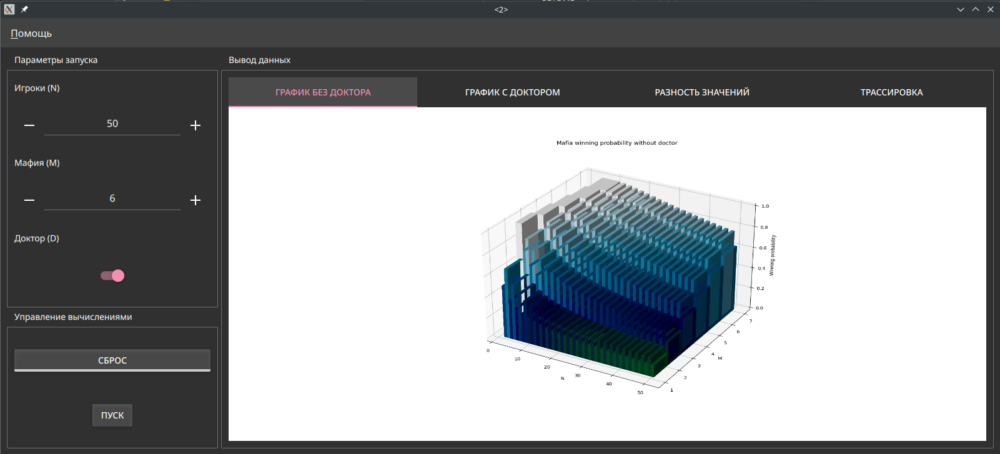

# Подсчет шанса выигрыша мафии

Программный комплекс моделирует шанс победы мирного города при разном соотношении общего числа игроков N и мафий M в зависимости от
наличия в игре доктора D. Интерфейс:



Выводятся графики с доктором, без доктора, график разности значений при наличии/отсутствии доктора. Трассировка
отображает численные значения подсчетов.

Запуск приложения:

``` sh
pyrcc5 -o game/resources.py resources.qrc
python main.py
```
